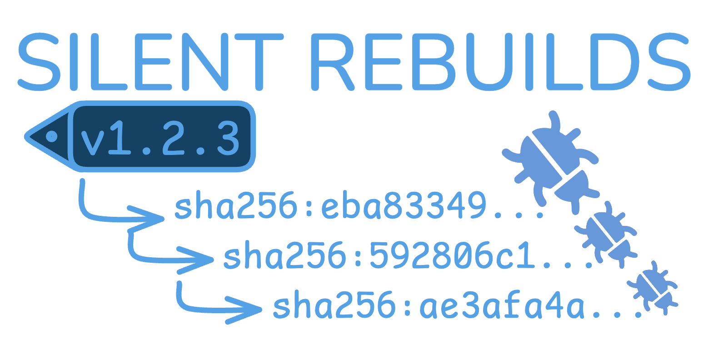

# Silent Rebuilds

Detecting every upstream image change (and GitHub Action change). Then creating PRs of updated tag + digest pinnings. The best way to keep container CVE counts low, while controlling dependency changes and locking to specific digests.

> Starting with a slim/distroless container image is necessary today, but it isn't enough. You need daily automation to trigger rebuilds for dependencies and base image digest updates



This repo gives examples of using [GitHub Dependabot](https://docs.github.com/en/code-security/dependabot/working-with-dependabot/automating-dependabot-with-github-actions), [Mend Renovate](https://github.com/marketplace/actions/renovate-bot-github-action), and [Chainguard Digestabot](https://github.com/chainguard-dev/digestabot) in GitHub Actions for container image updates via tag-watching and digest-watching of upstream registries. Bonus round: this repo also shows how to pin GitHub Actions to specific digests using Dependabot.

Thanks to [Chainguard](https://www.chainguard.dev/) for sponsoring the creation of this repository. 

Video walkthrough: I streamed a workshop with [@ericsmalling](https://github.com/ericsmalling) of us walking through this problem and solution. You can [get the edited video here](https://learn.bretfisher.com/chainguard-event).

Written walkthrough: Here's a detailed walkthrough of the problem and solution: [Silent Rebuilds: Keeping Container CVE Counts Near-Zero](https://www.bretfisher.com/silent-rebuilds/)

## Goals for this repo's examples of automating image updates

- Describe the problem of Silent Rebuilds and how version pinning of upstream base images isn't sufficient.
- Demonstrate how to automate daily checks for new "Silent Rebuilds" of your upstream container images.
- Demonstrate how to automate PRs for updating both the image tag and digest in your Dockerfiles, Compose files, Kubernetes manifests, and Helm charts.
- Demonstrate how to automate PRs for updating GitHub Actions to pin to specific digests.

## The upstream base image "Silent Rebuilds" problem

Many official container images on Docker Hub and other registries are periodically rebuilt without changing the tag version. This can happen for various reasons, such as security patches to the base OS dependencies, updates to the metadata, or even no change at all (A repo change happened, but didn't result in image file changes). Regardless of the reason, these "silent rebuilds" can lead to situations where a container image tagged with the same version has different contents over time. We assume these rebuilds should trigger a downstream PR for deploying the new images, so the first step is getting tools in place to watch for changing digests and notifying humans (via PRs) of new upstream images.

For examples of how often this happens, see the [digest-counts](./digest-counts) folder in this repo, which shows a snapshot of digest changes for popular images like NGINX, Node.js, and Python over several months. You can also look at the merged PRs in this repo to see real examples of digest changes detected by the automation.

As we try to shorten the time between vulnerability disclosures and patch deployments, silent rebuilds can complicate our efforts. If we're not aware that an image has been silently rebuilt, we might miss critical updates that address newly discovered vulnerabilities.

Also, if we're pinning to specific tags or digests in our deployment manifests, we might inadvertently miss out on important updates if those tags or digests change without humans getting a notification (PRs) when the image is rebuilt.

## Tool list

- [Dependabot](https://docs.github.com/en/code-security/dependabot/dependabot-version-updates/configuration-options-for-the-dependabot.yml-file#package-ecosystem) - GitHub's native tool for dependency updates, including Docker images.
- [Renovate](https://docs.renovatebot.com/modules/manager/dockerfile/) - A popular open source dependency update tool.
  - [Renovate GitHub Action](https://github.com/marketplace/actions/renovate-bot-github-action) - Official GitHub Action for running Renovate.
- [Digestabot GitHub Action](https://github.com/chainguard-dev/digestabot) - A newer open source tool from Chainguard focused on keeping container image digests up to date.
- [Grype](https://github.com/anchore/grype) - A vulnerability scanner for container images used in the CVE scanning examples.
  - [Grype GitHub Action](https://github.com/marketplace/actions/anchore-container-scan) - Official GitHub Action for running Grype scans.

## This repo's recommended approach

Container CVE and version updates often have (at least) two goals that can conflict if not managed properly: a) ensure we're using the most secure and up-to-date images, and b) maintain stability and predictability in our deployments.

To balance these goals, this repo recommends the following approach:

1. **Pin to image tags *and* digests**: In your Dockerfiles, Compose files, Kubernetes manifests, and Helm charts, always pin to both the image tag and its corresponding digest. This ensures that you're using a specific, known version of the image while also allowing for updates when the tag is rebuilt.

   Example:
   ```yaml
   image: nginx:1.29.2@sha256:f79cde317d4d172a392978344034eed6dff5728a8e6d7a42f507504c23ecf8b8
   ```

   Note: The way container runtimes resolve tags and digests is that **if both are specified, the tag is ignored** and the digest is used by the machine to pull the image. However, we do need the tag for humans to understand what version it's using. By automating the updates of these two, we can reduce the potential for human error (forgetting to keep the tag and digest in sync).

2. **Use CI/CD automation to provide PRs for updates to tags and digests**: Set up GitHub Actions using Dependabot, Renovate, and/or Digestabot to monitor your container images. Configure these tools to create pull requests whenever a new tag or digest is detected. I generally set GHA cron to run these daily.

3. **Ensure your tooling can detect new digests for the same tag**: Test and verify that your chosen tools can detect when a tag has been silently rebuilt and update the digest accordingly. This is crucial for staying up-to-date with security patches.

4. **Also pin digests for each GitHub Action**: In your GitHub Actions workflows, pin its digest rather than (mutable) tag to ensure you're using a specific, known version of the action. This helps maintain consistency and security in your CI/CD pipeline, and *helps* avoid (but doesn't prevent) some attack vectors in your image build workflows (like the S1ngularity GitHub Actions attack). 

   Example:
   ```yaml
    steps:
      - uses: actions/checkout@692973e3d937129bcbf40652eb9f2f61becf3332 # v4.1.7
   ```

## Tool feature support matrix

Each of the three tools has different levels of support for the features needed to fully implement the recommended approach above. Here's a summary of their capabilities as of October 2025:

| Feature                                                | Dependabot | Renovate | Digestabot |
|--------------------------------------------------------|------------|----------|------------|
| Pin to both tag and digest in manifests                | Yes        | Yes      | Yes        |
| Detect new digests for the same tag                    | Yes        | Yes      | Yes        |
| Create PRs for tag updates                             | Yes        | Yes      | **No**     |
| Create PRs for digest updates                          | Yes        | Yes      | Yes        | 
| Update GitHub Actions to pin to digest                 | Yes        | Yes      | **No**     |
| Support Dockerfiles                                    | Yes        | Yes      | Yes        |
| Support Docker Compose files                           | Yes        | Yes      | Yes        |
| Support Kubernetes manifests                           | Yes        | Yes      | Yes        |
| Support Helm charts                                    | Yes        | Yes      | Yes        |
| Supports Chainguard Images (cgr.dev)                   | **No**     | Yes      | Yes        |

- You can get away with all image updates in Dependabot or Renovate, but because Dependabot doesn't support Chainguard's image registry, Renovate is preferred if you use cgr.dev images.
